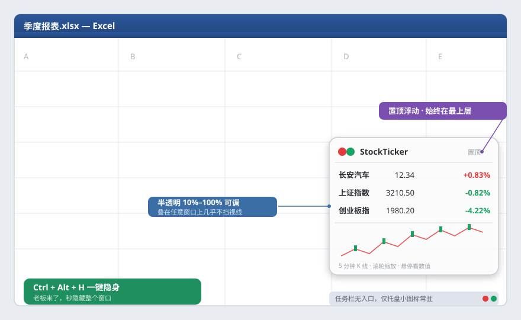

# StockTicker · 桌面浮动行情小工具

一个隐蔽、可置顶、能放在任意工作页面上的 Windows 桌面浮动行情小工具。
自动刷新自选标的的实时行情与 K 线，支持主题切换、透明度/缩放调节、K 线周期切换、
鼠标滚轮缩放 K 线、悬停看数值、设置自动记忆、以及一键安装/卸载的标准化安装包。

> 数据来源：东方财富公开行情接口（非逐笔延迟行情，仅供参考，不构成投资建议）。

---

## 🌟 半透明摸鱼模式（核心卖点）

上班也能「盯着大盘」，还不被发现 —— StockTicker 天生为摸鱼而生：


- **半透明浮窗**：透明度 10%–100% 可调，叠在任意工作窗口（Excel、代码、文档）上都几乎不挡视线，老板路过也只是一块淡淡的小面板。
- **置顶浮动**：始终在最上层，切到哪个窗口它都跟着你，行情不离眼。
- **无任务栏入口**：窗口不进任务栏，只有托盘一个小图标常驻，任务栏干干净净。
- **一键隐身**：`Ctrl + Alt + H` 或点托盘图标，整个窗口秒隐藏 / 秒唤回 —— 老板来了，一秒切回「认真工作」界面。
- **设置记忆**：透明度、位置、周期全部自动记住，下次打开直接是熟悉的摸鱼姿势。

功能示意（半透明面板 + 置顶 / 隐藏 / 托盘说明）：



---

## 功能特性

- **浮动置顶**：半透明小窗，可放在任意窗口之上，单击拖拽、不挡操作。
- **多标的**：默认监控 `长安汽车(000625)`、`上证指数(000001)`、`创业板指(399006)`，可随时增删。
- **实时刷新**：最短间隔自动拉取行情（默认 3 秒），K 线周期到点刷新。
- **K 线**：蜡烛图 + 悬停数值（含该根 K 线时间戳，便于核对周期）；支持滚轮缩放可见根数。
- **周期**：1 / 5 / 15 / 30 / 60 分钟、日 K、周 K（已逐周期联网核对接口参数）。
- **主题**：深 / 浅两种底色，悬停数值框底色随主题。
- **可调**：透明度 10%–100%、窗口缩放 10%–100%。
- **设置记忆**：主题、透明度、缩放、K 线周期、显隐、激活标的、自选列表、窗口位置均自动持久化到
  `%APPDATA%\StockTicker\config.json`，重启恢复。
- **标准化安装**：提供 `StockTickerSetup.exe` 安装向导（默认装到
  `%LOCALAPPDATA%\Programs\StockTicker`，**无需管理员**，自动建快捷方式 +
  写卸载注册表），配套 `Uninstall.exe` 干净卸载（无黑窗口、自清理）。

---

## 目录结构

```
stockticker/
├── src/
│   └── main.py              # 主程序源码（PySide6 桌面应用）
├── installer/
│   └── src/
│       ├── installer.py     # 安装向导源码（PySide6）
│       ├── uninstaller.py   # 卸载程序源码（无第三方依赖）
│       └── app.ico          # 图标（与 assets/app.ico 相同）
├── assets/
│   └── app.ico              # 应用图标
├── StockTicker.spec         # 主程序 PyInstaller 打包配置
├── README.md
└── LICENSE
```

> 编译产物（`dist/`、`build/`、所有 `.exe`、自动生成的 `*.spec`）已通过 `.gitignore` 排除，不入库。
> 重新打包时，按下方「构建」步骤生成这些二进制即可。

---

## 环境要求

- Windows 10/11
- Python 3.13（开发/打包用，最终交付的是独立 EXE，运行端无需 Python）
- 依赖：`PySide6`（6.11.x）、`requests`、`PyInstaller`（6.21.x）

```bash
pip install PySide6==6.11.1 requests PyInstaller==6.21.0
```

---

## 构建（从源码打包成 EXE）

> 顺序很重要：先主程序，再安装器（安装器会把主程序与卸载器内嵌进安装包）。

### 1. 主程序 `StockTicker.exe`

```bash
cd stockticker
pyinstaller StockTicker.spec --noconfirm --clean
# 产出：dist/StockTicker.exe
```

### 2. 卸载器 `Uninstall.exe`

```bash
cd stockticker/installer/src
pyinstaller --onefile --noconsole --name Uninstall --icon app.ico uninstaller.py
# 产出：dist/Uninstall.exe
```

### 3. 安装器 `StockTickerSetup.exe`（内嵌主程序 + 卸载器 + 图标）

```bash
cd stockticker/installer/src
# 先把上面两个 EXE 放进本目录，供 --add-data 内嵌
cp ../../dist/StockTicker.exe ./StockTicker.exe
cp dist/Uninstall.exe ./Uninstall.exe

pyinstaller --onefile --noconsole --name StockTickerSetup --icon app.ico \
  --add-data "StockTicker.exe;." --add-data "Uninstall.exe;." --add-data "app.ico;." \
  installer.py
# 产出：dist/StockTickerSetup.exe
```

打包完成后，`StockTickerSetup.exe` 即为可分发给他人的标准化安装包。

---

## 使用说明

启动后是一个半透明小窗，右键打开菜单：

| 操作 | 说明 |
|------|------|
| 单击并拖动 | 移动窗口 |
| 双击某一行 | 切换该标的的 K 线 |
| 双击空白区域 | 显示 / 隐藏 K 线 |
| 鼠标滚轮（在 K 线区） | 缩放 K 线可见根数 |
| 鼠标悬停（在 K 线上） | 显示该根 K 线时间戳与开/高/低/收 |
| `Ctrl + Alt + H` / 托盘图标 | 显示 / 隐藏整个窗口 |
| 右键菜单 | 主题（深/浅）、透明度、窗口缩放、K 线周期、添加/删除股票、操作说明、退出 |

设置会自动记忆；重装或换机后从 `%APPDATA%\StockTicker\config.json` 读取。

---

## 卸载

- 方式一： Windows「设置 → 应用」或「控制面板 → 程序和功能」中找到 **StockTicker** 卸载；
- 方式二：运行安装目录下的 `Uninstall.exe`。
- 卸载会删除程序文件、桌面/开始菜单快捷方式、卸载注册表项，并自清理安装目录（无黑窗口）。

---

## 免责声明

- 行情数据来自第三方公开接口，存在延迟，仅供参考，**不构成任何投资建议**。
- 程序未做代码签名，首次运行可能被 Windows Defender / 杀软拦截，属正常现象，选择「仍要运行」即可。
- 本项目仅用于学习与技术交流。

---

## 许可证

[MIT](./LICENSE)
